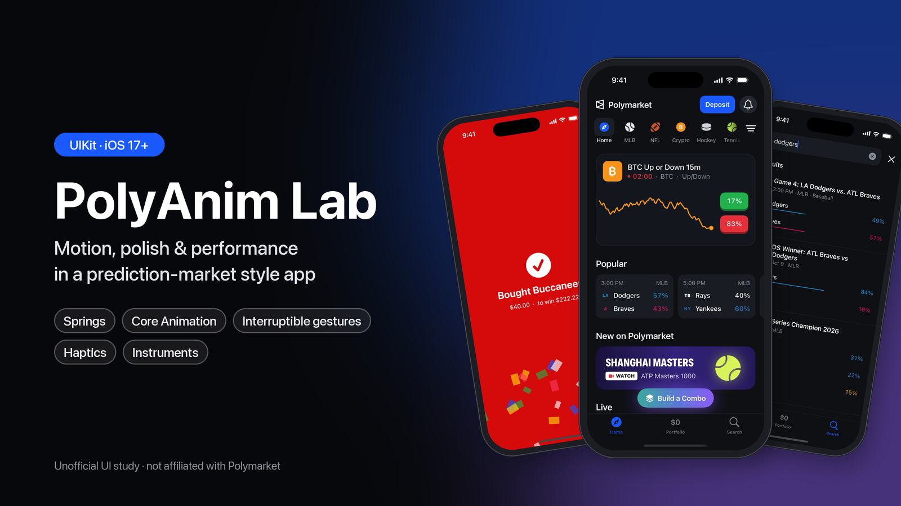

# PolyAnim Lab

[](demo/PolyAnimLab-demo.mp4)

https://github.com/user-attachments/assets/73c06963-aae7-4125-91f3-a7f99c2c6aaa

▶︎ **[Watch the 27-second demo](demo/PolyAnimLab-demo.mp4)**: launch animation, live markets, category paging, the bet slip with swipe to buy, and search. The music is original, generated by [`scripts/make_demo_music.py`](scripts/make_demo_music.py).

A UIKit animation and performance study: a prediction-market-style iOS app built to explore motion, interaction polish, and rendering performance. Several screens were recreated frame by frame from screen recordings of the Polymarket iOS app as a UI exercise.

> **Unofficial.** This is an independent study project. It is not affiliated with, endorsed by, or connected to Polymarket. All market data is simulated, no real trading happens, and team names and marks are placeholders.

## What's inside

- **Launch animation:** seamless hand-off from the static launch screen, a wordmark wipe, and a fake-3D spinning helmet with speed-scaled motion blur.
- **Home:** a category bar whose highlight tracks the pager, a live BTC Up/Down card with a ticking countdown and sparkline, game cards with springy odds bars and press-down 3D pills, and a floating Build a Combo button.
- **Bet slip:** a full-screen sheet with the presenter receding, a keypad, a rolling amount, swipe-to-buy with a haptic detent and velocity hand-off, and a success state with confetti.
- **Search:** a focus transition, debounced search with a loading state, and staggered result entrance.
- **Lab (bell menu):** an animation Playground (timing curves, interruptible fling, keyframes, slow-mo), a Perf Lab with an optimized/unoptimized list for Instruments, the v1 demo, and a frame-rate/hitch HUD.

See [TECHNICAL_NOTES.md](TECHNICAL_NOTES.md) for the techniques behind each piece and how to profile them.

## Running

Requirements: Xcode 26+, iOS 17+ Simulator or device, [XcodeGen](https://github.com/yonaskolb/XcodeGen).

```bash
xcodegen generate
open PolyAnimLab.xcodeproj
```

The `.xcodeproj` is generated from `project.yml` and isn't committed. Re-run `xcodegen generate` after adding files. To regenerate the launch logo asset, run `swift scripts/render_launch_logo.swift`.

To profile performance, use a Release build on a real device. The simulator's numbers aren't representative.

## Code style

UIKit, no storyboards. Subviews are `lazy var`s configured inside their own closures; `init` / `viewDidLoad` call `setupViews()` for hierarchy and constraints.
